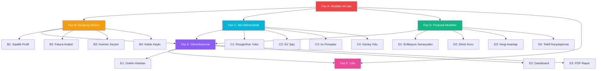

# GüneşHesap v2.0 — 17 Yeni Özellik Uygulama Planı

**Tarih:** 2026-04-11
**Mevcut Durum:** Monolitik SPA (`index.html` ~3500 satır), Leaflet + Chart.js + jsPDF
**Hedef:** Profesyonel-grade GES mühendislik aracı

---

## Mimari Karar

> [!IMPORTANT]
> **Modüler Dosya Yapısına Geçiş Gerekli**
> 
> Mevcut monolitik `index.html` (3500+ satır) zaten yönetim sınırında. 17 yeni özellik eklemek dosyayı ~8000-10000 satıra çıkarır — sürdürülebilir değil.
> 
> **Önerilen Yapı:**
> ```
> GüneşHesap/
> ├── index.html            ← Sadece HTML yapısı + CSS
> ├── js/
> │   ├── app.js            ← State, navigation, init
> │   ├── data.js           ← Panel/şehir/sabitler
> │   ├── calc-engine.js    ← Hesaplama motoru
> │   ├── calc-financial.js ← Finansal modeller
> │   ├── ui-render.js      ← Sonuç gösterimi
> │   ├── ui-charts.js      ← Grafik/gauge
> │   ├── eng-report.js     ← Mühendis raporu
> │   ├── pdf-export.js     ← PDF rapor
> │   ├── i18n.js           ← Dil sistemi
> │   ├── hourly-profile.js ← Saatlik üretim
> │   ├── bill-analysis.js  ← Fatura analizi
> │   ├── inverter.js       ← İnverter seçimi
> │   ├── cable-loss.js     ← Kablo kaybı
> │   ├── structural.js     ← Rüzgar/kar yükü
> │   ├── ev-charging.js    ← EV şarj
> │   ├── heat-pump.js      ← Isı pompası
> │   ├── sun-path.js       ← Güneş yolu
> │   ├── scenarios.js      ← Enflasyon/döviz
> │   ├── tax.js            ← Vergi avantajı
> │   ├── comparison.js     ← Teklif karşılaştırma
> │   ├── dashboard.js      ← Karşılaştırmalı DB
> │   └── heatmap.js        ← Türkiye ısı haritası
> ├── css/
> │   └── components.css    ← Yeni bileşen stilleri
> ├── locales/
> │   ├── tr.json
> │   ├── en.json
> │   └── de.json
> ├── service-worker.js
> ├── manifest.json
> └── vercel.json
> ```
>
> **JS dosyaları `<script type="module">` ile yüklenir, build sistemi gerekmez.**

---

## Faz A: Temel Altyapı (Önkoşul)

> Diğer tüm fazlar buna bağımlı. İlk yapılmalı.

### A1. Monolitik Dosyayı Modüllere Parçala

**Yapılacak:**
- `index.html` içindeki `<script>` bloğunu mantıksal modüllere ayır
- Her modül `export` ile API'sini dışa açar
- `app.js` ana orkestratör olarak `import` ile birleştirir
- `state` nesnesi `app.js`'de kalır, diğer modüllere parametre olarak geçirilir

**Parçalama Haritası:**
| Kaynak Satır Aralığı | Hedef Dosya | İçerik |
|---|---|---|
| 1427-1620 | `data.js` | PANEL_TYPES, COMPASS_DIRS, CITIES, BATTERY_MODELS, PSH_FALLBACK, MONTH_WEIGHTS, DEFAULT_TARIFFS |
| 1620-1660 | `app.js` | state, init, goToStep, navigation |
| 1660-1900 | `app.js` | UI helpers (positionRangeThumb, updateTilt, updateShading, updateSoiling, etc.) |
| 1900-2000 | `app.js` | validateStep1/2/3, panel cards |
| 2000-2120 | `app.js` | Map init, city search, geolocation |
| 2120-2260 | `app.js` | Multi-roof, battery toggle, NM toggle, O&M toggle |
| 2260-2350 | `calc-engine.js` | calculateBatteryMetrics, calculateNMMetrics |
| 2350-2720 | `calc-engine.js` | runCalculation (PVGIS fetch, energy calc) |
| 2550-2670 | `calc-financial.js` | 25-year NPV, IRR, LCOE, ROI |
| 2720-2860 | `ui-render.js` | renderResults, renderMonthlyChart |
| 2860-2950 | `ui-render.js` | downloadPDF (temel), shareResults, loadFromHash |
| 2950-3050 | `ui-charts.js` | renderPRGauge, confetti, toast |
| 3050-3500 | `eng-report.js` | renderEngReport (tüm bölümler) |

**Geçiş Stratejisi:**
1. Mevcut kodu olduğu gibi modüllere kopyala
2. `window.state` ile geçici bağlantı kur
3. Her modülü test et
4. Sonra yeni özellikleri modüller olarak ekle

### A2. CSS Bileşen Dosyası
- Yeni özellikler için `css/components.css` oluştur
- Mevcut CSS `index.html`'de kalabilir (zaten optimize)

---

## Faz B: Gelişmiş Girdiler (Özellikler 2, 3, 4, 5)

### B1. Saatlik Üretim Profili (#2)
**Dosya:** `js/hourly-profile.js`

**Veri Modeli:**
```javascript
const HOURLY_SOLAR_PROFILE = {
  // Normalize edilmiş saatlik güneş ışınım profili (0-1)
  summer: [0,0,0,0,0,0.02,0.08,0.18,0.35,0.55,0.75,0.90,0.95,1.00,0.95,0.88,0.72,0.50,0.28,0.10,0.02,0,0,0],
  winter: [0,0,0,0,0,0,0,0.05,0.15,0.32,0.52,0.70,0.78,0.75,0.65,0.45,0.22,0.05,0,0,0,0,0,0],
  spring: [0,0,0,0,0,0.01,0.05,0.14,0.28,0.48,0.68,0.82,0.90,0.92,0.85,0.70,0.50,0.30,0.12,0.03,0,0,0,0]
};
```

**Hesaplama:**
- `hourlyProduction[h] = dailyProduction × solarProfile[season][h]`
- Yaz: Haziran-Ağustos, Kış: Aralık-Şubat, İlkbahar/Sonbahar: diğer aylar
- Self-consumption overlap: `min(production[h], consumption[h])` her saat için

**UI:**
- Step 5 sonuçlarında yeni "Saatlik Üretim Profili" kartı
- Chart.js line chart: X=saat(0-23), Y=kWh
- İki çizgi: Üretim (sarı gradient) + Tüketim (mavi çizgi)
- Kesişim alanı yeşil dolgulu (self-consumption)
- Sezon toggle: Yaz / Kış / İlkbahar butonları

**Tüketim Profili:**
```javascript
// Türkiye tipik konut saatlik tüketim (normalize)
const RESIDENTIAL_LOAD = [0.02,0.02,0.02,0.02,0.02,0.03,0.05,0.06,0.04,0.03,0.03,0.03,
                          0.04,0.04,0.04,0.04,0.05,0.07,0.08,0.08,0.07,0.06,0.04,0.03];
```

---

### B2. Elektrik Fatura Analizi (#3)
**Dosya:** `js/bill-analysis.js`

**UI — Step 3 (Gelişmiş Seçenekler bölümü):**
- "Aylık Fatura Girişi" toggle bloğu
- 12 input alanı (Ocak-Aralık), her biri kWh cinsinden
- "Hızlı Doldur" butonu: Aylık ortalama gir → mevsim katsayılarıyla dağıt
- "Toplam: XXX kWh/yıl | Ortalama: XX kWh/gün" özet satırı

**Hesaplama Etkileri:**
- `state.monthlyConsumption[12]` dizisi state'e eklenir
- `selfConsumptionRatio` artık aylık hesaplanır (aylık üretim vs aylık tüketim)
- Net metering export de aylık bazda hesaplanır
- BESS boyutlandırma gerçek yaz/kış dengesine göre olur

**Sonuç Görselleştirme:**
- Step 5'te mevcut aylık grafik → çift eksenli: üretim barları + tüketim çizgisi
- Stacked area: Self-consumption (yeşil) + Grid export (mavi) + Grid import (kırmızı)

---

### B3. Çoklu İnverter Seçimi (#4)
**Dosya:** `js/inverter.js`

**Veri Modeli:**
```javascript
const INVERTER_TYPES = {
  string: {
    name: 'String İnverter',
    efficiency: 0.97,      // %97 CEC verimliliği
    pricePerKWp: { '<10': 7500, '10-50': 6500, '>50': 5500 },
    shadeTolerance: 0.65,  // Gölgede %35 kayıp
    lifetime: 12,          // Yıl
    advantages: ['Düşük maliyet', 'Kolay bakım', 'Yüksek güçte verimli'],
    disadvantages: ['Gölgede tüm string etkilenir', 'Tek arıza noktası']
  },
  micro: {
    name: 'Mikro İnverter',
    efficiency: 0.965,
    pricePerKWp: { '<10': 12000, '10-50': 11000, '>50': 10000 },
    shadeTolerance: 0.90,  // Panel başına bağımsız — gölgede %10 kayıp
    lifetime: 20,          // 20+ yıl ömür
    advantages: ['Panel bazlı optimizasyon', 'Gölgeye dayanıklı', 'Uzun ömür'],
    disadvantages: ['Yüksek maliyet', 'Çatıda bakım zorluğu']
  },
  optimizer: {
    name: 'DC Optimizör + String',
    efficiency: 0.985,     // Optimizör + string toplam
    pricePerKWp: { '<10': 9500, '10-50': 8500, '>50': 7500 },
    shadeTolerance: 0.85,
    lifetime: 15,
    advantages: ['İyi gölge toleransı', 'Panel izleme', 'Orta maliyet'],
    disadvantages: ['String inverter hâlâ gerekli', 'Ek kablolama']
  }
};
```

**UI — Step 2 (Panel seçimi altı):**
- 3 inverter kartı (string/mikro/optimizör) — panel kartlarına benzer tasarım
- Her kart: Verimlilik %, Gölge Toleransı, Ömür, Fiyat aralığı
- Seçim `state.inverterType` olarak kaydedilir

**Hesaplama Entegrasyonu:**
- `inverterCost` seçilen tipe göre hesaplanır
- Gölge kaybı `shadeTolerance` ile modüle edilir
- İnverter ömrü yenileme yılını belirler (12/15/20)
- `inverterEfficiency` enerji hesabında çarpan olarak eklenir

---

### B4. Kablo Kayıp Hesabı (#5)
**Dosya:** `js/cable-loss.js`

**UI — Step 3 (Gelişmiş Seçenekler):**
- "Kablo Kayıp Hesabı" toggle bloğu (varsayılan kapalı)
- Girdiler:
  - DC kablo uzunluğu (m) — panelden invertere
  - DC kablo kesiti (mm²) — dropdown: 4, 6, 10, 16 mm²
  - AC kablo uzunluğu (m) — inverterden panoya

**Hesaplama:**
```
I_dc = P_stc / V_mpp                    // DC akım
R_dc = ρ × L × 2 / A                    // DC kablo direnci (gidiş-dönüş)
P_loss_dc = I_dc² × R_dc                // DC kablo kaybı
Cable_loss% = P_loss_dc / P_stc × 100   // Yüzde olarak

// AC tarafı benzer şekilde
ρ_cu = 0.0175 Ω·mm²/m                   // Bakır özdirenç (20°C)
```

**Entegrasyon:**
- Hesaplanan kablo kaybı `PVGIS loss` parametresine eklenir (mevcut 10% + kablo kaybı)
- Kayıp şelalesine "Kablo Kaybı" satırı eklenir
- Mühendis raporuna kablo hesap detayı eklenir

---

## Faz C: İleri Mühendislik (Özellikler 6, 7, 8, 22)

### C1. Rüzgar & Kar Yükü Kontrolü (#6)
**Dosya:** `js/structural.js`

**Veri Modeli:**
```javascript
// TS EN 1991-1-3 Kar yükü bölgeleri
const SNOW_ZONES = {
  'İstanbul': { zone: 2, sk: 0.75 },  // kN/m²
  'Ankara': { zone: 3, sk: 1.00 },
  'Erzurum': { zone: 5, sk: 2.50 },
  // ... 81 il
};

// TS EN 1991-1-4 Rüzgar bölgeleri
const WIND_ZONES = {
  'İstanbul': { zone: 2, vb: 33.5 },  // m/s referans hız
  'Antalya': { zone: 1, vb: 28.0 },
  // ... 81 il
};
```

**Hesaplama:**
```
// Kar yükü (eğimli çatı)
μ = 0.8 × (60 - α) / 30  (α < 60°)     // Şekil katsayısı
s = μ × Ce × Ct × sk                     // Tasarım kar yükü

// Rüzgar basıncı
q_p = 0.5 × ρ × v_b² × ce(z) × cp       // Tepe basıncı
F_wind = q_p × A_panel × sin(α)          // Panel üzerindeki kuvvet
```

**UI — Step 5 Sonuçlar:**
- "Yapısal Kontrol" kartı — Yeşil/Turuncu/Kırmızı durum badge'i
- Kar yükü: OK / Dikkat / Panel eğimini azaltın uyarısı
- Rüzgar: OK / Ek montaj bağlantısı gerekli uyarısı
- Montaj sistemi minimum kuvvet gereksinimi (kN/m²)

---

### C2. EV Şarj Entegrasyonu (#7)
**Dosya:** `js/ev-charging.js`

**UI — Step 3:**
- "EV Şarj" toggle bloğu
- Girdiler:
  - Günlük ortalama sürüş mesafesi (km) — slider 10-200
  - Araç tipi: Sedan (18 kWh/100km) / SUV (22 kWh/100km) / Özel
  - Şarj saati: Gündüz (güneşle direkt) / Gece (bataryadan/şebekeden)

**Hesaplama:**
```
ev_daily_kWh = distance × consumption_per_km / 100
ev_annual_kWh = ev_daily_kWh × 365

// Gündüz şarj → self-consumption artışı
// Gece şarj → batarya veya şebeke gereksinimi

total_consumption = household + ev_daily_kWh
additional_panels_needed = ceil((ev_annual_kWh) / (panel_annual_kWh))
```

**Sonuç Gösterimi:**
- "EV Şarj Analizi" sonuç kartı
- Yıllık yakıt tasarrufu (benzin vs elektrik) — TL cinsinden
- Güneşle şarj edilen oran (%)
- Ek panel ihtiyacı (adet)

---

### C3. Isı Pompası Entegrasyonu (#8)
**Dosya:** `js/heat-pump.js`

**UI — Step 3:**
- "Isı Pompası" toggle bloğu
- Girdiler:
  - Bina alanı (m²) — slider 50-500
  - Yalıtım seviyesi: İyi/Orta/Zayıf
  - Isıtma türü: Sadece ısıtma / Isıtma+Soğutma
  - Mevcut ısıtma: Doğalgaz / Kömür / Elektrik

**Veri Modeli:**
```javascript
const HEAT_PUMP_DATA = {
  // COP (Verimlilik katsayısı) — mevsime göre
  cop_heating: { good: 4.0, avg: 3.5, poor: 3.0 },
  cop_cooling: { all: 5.5 },
  // Bina ısıtma yükü (kWh/m²/yıl)
  heat_load: { good: 50, avg: 80, poor: 120 },
  // Doğalgaz birim fiyat (TL/m³)
  gas_price: 7.50,
  gas_kwh_per_m3: 10.64
};
```

**Hesaplama:**
```
annual_heat_demand = area × heat_load[insulation]  // kWh/yıl
hp_electricity = annual_heat_demand / COP          // Isı pompası elektrik
gas_equivalent = annual_heat_demand / gas_kwh_per_m3 × gas_price
savings = gas_equivalent - hp_electricity × tariff
```

**Sonuç:** "Isı Pompası Analizi" kartı — yıllık tasarruf, güneşle karşılanan oran

---

### C4. Güneş Yolu Diyagramı (#22)
**Dosya:** `js/sun-path.js`

**Hesaplama — SPA (Solar Position Algorithm):**
```javascript
function solarPosition(lat, lon, dateTime) {
  // Declination angle
  const dayOfYear = getDayOfYear(dateTime);
  const declination = 23.45 * Math.sin(toRad(360/365 * (dayOfYear - 81)));
  
  // Hour angle
  const solarNoon = 12 - (lon - 30) / 15; // Türkiye UTC+3 → ref 30°E
  const hourAngle = 15 * (dateTime.getHours() - solarNoon);
  
  // Solar elevation
  const elevation = Math.asin(
    Math.sin(toRad(lat)) * Math.sin(toRad(declination)) +
    Math.cos(toRad(lat)) * Math.cos(toRad(declination)) * Math.cos(toRad(hourAngle))
  );
  
  // Solar azimuth
  const azimuth = Math.atan2(
    -Math.sin(toRad(hourAngle)),
    Math.tan(toRad(declination)) * Math.cos(toRad(lat)) - Math.sin(toRad(lat)) * Math.cos(toRad(hourAngle))
  );
  
  return { elevation: toDeg(elevation), azimuth: toDeg(azimuth) + 180 };
}
```

**UI:**
- Canvas/SVG polar diyagram
- X: Azimut (0-360°), Y: Elevasyon (0-90°)
- 12 ay çizgisi (renkli eğriler)
- 21 Haziran ve 21 Aralık vurgulu
- Saat işaretleri eğri üzerinde
- Çatı yön okunu diyagram üzerine yerleştir

---

## Faz D: Finansal Modeller (Özellikler 10, 11, 12, 13)

### D1. Enflasyon Senaryoları (#10)
**Dosya:** `js/scenarios.js`

**UI — Step 5 Sonuçlar:**
- "Senaryo Analizi" kartı
- 3 tab: Düşük (%15) / Orta (%25) / Yüksek (%40) enflasyon
- + Özel senaryo: kullanıcı kendi oranını girer
- Her senaryo için: NPV, IRR, geri ödeme, 25 yıl toplam

**Hesaplama:**
- Mevcut `annualPriceIncrease` yerine senaryo bazlı hesaplama
- Tab değiştiğinde sonuçlar anlık güncellenir
- Chart.js ile 3 eğri aynı grafikte (kümülatif nakit akışı)

---

### D2. Döviz Kuru Projeksiyon (#11)
**Dosya:** `js/scenarios.js` (aynı dosya)

**UI:**
- "Döviz Kuru Projeksiyon" alt kartı (NM aktifse görünür)
- Girdiler: Mevcut USD/TRY, yıllık artış beklentisi (%)
- Alt/Baz/Üst senaryo: ±%10 sapma bandı

**Hesaplama:**
```
usd_try[year] = base × (1 + growth_rate)^year
yekdem_revenue[year] = export_kwh[year] × 0.133 × usd_try[year]
```

**Görselleştirme:**
- Fan chart  (merkez çizgi + güven bandı)
- 10 yıllık projeksiyon (YEKDEM süresi)

---

### D3. Vergi Avantajı Hesabı (#12)
**Dosya:** `js/tax.js`

**UI — Step 3 Gelişmiş Seçenekler:**
- "Vergi Avantajı" toggle bloğu (sadece Ticari/Sanayi tarife seçildiğinde görünür)
- Girdiler:
  - Kurumlar Vergisi oranı (%) — default 25
  - Amortisman süresi (yıl) — default 10
  - KDV iade uygunluğu (evet/hayır)
  - Yatırım indirimi (evet/hayır)

**Hesaplama:**
```
annual_depreciation = totalCost / amortization_years
tax_shield = annual_depreciation × corporate_tax_rate
kdv_recovery = totalCost × 0.20  // Bir seferlik (yıl 0)

// NPV'ye etkisi
adjusted_npv = original_npv + Σ(tax_shield / (1+d)^t) + kdv_recovery
effective_payback = recalculated with tax benefits
```

**Sonuç:**
- "Vergi Avantajı Özeti" — toplam vergi tasarrufu, efektif maliyet, düzeltilmiş geri ödeme

---

### D4. Rekabetçi Teklif Karşılaştırma (#13)
**Dosya:** `js/comparison.js`

**UI — Step 5 sonrasında yeni bir bölüm:**
- "Teklif Karşılaştır" butonu → modal/tam ekran açılır
- 3 sütun: Senaryo A / B / C
- Her sütunda:
  - Panel tipi seçimi
  - İnverter tipi seçimi
  - Özel fiyat girişi (TL/Wp veya toplam TL)
  - Ek maliyet kalemleri

**Hesaplama:**
- Her senaryo mevcut `runCalculation()` motorunu farklı parametrelerle çağırır
- Sonuçlar yan yana tablo:

| Metrik | Senaryo A | Senaryo B | Senaryo C |
|--------|-----------|-----------|-----------|
| Panel | Mono PERC | Bifacial | Kullanıcı |
| Sistem (kWp) | 8.60 | 8.60 | 8.60 |
| Yıllık üretim | 13,400 | 14,200 | ??? |
| Maliyet | 280,000 | 340,000 | ??? |
| Geri ödeme | 4.2 yıl | 4.8 yıl | ??? |
| LCOE | 1.85 | 2.12 | ??? |
| NPV | 1.2M | 1.1M | ??? |
| **Önerilen** | ✅ | | |

---

## Faz E: Görselleştirme & Çıktı (Özellikler 16, 19, 20)

### E1. Üretim Animasyon Haritası (#16)
**Dosya:** `js/heatmap.js`

**Implementasyon:**
- Türkiye il sınırları GeoJSON (CDN'den veya inline ~50KB simplified)
- Leaflet choropleth eklentisi — her il PSH/üretim değerine göre renklendirilir
- 12 aylık animasyon: setInterval ile ay değişimi, renk gradyanı güncellenir
- Renk skalası: Koyu mavi (düşük) → Sarı → Kırmızı (yüksek)

**UI:**
- Step 5'te "Üretim Haritası" kartı
- Play/Pause butonu + ay göstergesi
- Seçilen il highlight
- İl üzerine hover → tooltip: "Ankara — 1,650 kWh/kWp, PSH: 4.3"

**Veri:**
- Mevcut `CITY_DATA` ve `PSH_FALLBACK` verisi kullanılır
- Her il: yıllık üretim potansiyeli (kWh/kWp)

---

### E2. Karşılaştırmalı Dashboard (#19)
**Dosya:** `js/dashboard.js`

**UI:**
- Header'a "Kayıtlı Hesaplar" butonu eklenir
- "Mevcut Hesabı Kaydet" butonu sonuç sayfasına eklenir
- Dashboard sayfası:
  - Kaydedilmiş hesaplar listesi (kart formatında)
  - "Karşılaştır" butonu — max 3 hesap seçilir
  - Yan yana karşılaştırma tablosu

**Depolama:**
- `localStorage` ile veri saklanır
- Her kayıt: `{ id, timestamp, cityName, systemPower, panelType, annualEnergy, totalCost, paybackYear, roi, lcoe, npv }`
- Maksimum 20 kayıt (FIFO)

**Karşılaştırma Grid:**
```
| | Antalya/30° | Edirne/35° | İstanbul/25° |
|---|---|---|---|
| Üretim | 15,200 kWh | 12,800 kWh | 11,500 kWh |
| Maliyet | 280K TL | 280K TL | 265K TL |
| LCOE | 1.62 | 1.93 | 2.03 |
| Geri Ödeme | 3.8 yıl | 4.5 yıl | 4.9 yıl |
```

---

### E3. Detaylı PDF Rapor (#20)
**Dosya:** `js/pdf-export.js`

**Sayfa Yapısı (A4):**

1. **Kapak Sayfası** — Logo + "Güneş Enerjisi Fizibilite Raporu" + Lokasyon + Tarih + QR code (share link)
2. **Yönetici Özeti** — 6 KPI kartı (enerji, tasarruf, maliyet, geri ödeme, ROI, LCOE) + küçük harita
3. **Sistem Tasarımı** — Panel bilgisi, çatı konfigürasyonu, inverter tipi, sistem gücü
4. **Enerji Analizi** — Aylık üretim grafiği (canvas→image), kayıp şelalesi, PR gauge
5. **Finansal Analiz** — Maliyet kırılımı tablosu, 25 yıl projeksiyon grafiği
6. **25 Yıl Tablo** — Yıllık detay tablosu (compact font)
7. **Ek Analizler** — BESS / Net Metering / EV / Isı Pompası (opsiyonel sayfalar)
8. **Yasal Uyarılar** — "Bu rapor bilgilendirme amaçlıdır..." disclaimer

**Implementasyon:**
```javascript
async function generateProfessionalPDF() {
  const { jsPDF } = window.jspdf;
  const doc = new jsPDF('p', 'mm', 'a4');
  
  // Chart'ları canvas olarak yakala
  const monthlyChartImg = document.getElementById('monthly-chart-canvas').toDataURL('image/png');
  
  // Sayfa 1: Kapak
  doc.setFillColor(15, 23, 42);
  doc.rect(0, 0, 210, 297, 'F');
  // ... kapak tasarımı
  
  // Sayfa 2: Özet
  doc.addPage();
  // ... KPI grid
  
  // Her bölüm için ayrı fonksiyon
  addSystemDesignPage(doc);
  addEnergyAnalysisPage(doc);
  addFinancialPage(doc);
  add25YearTablePage(doc);
  
  doc.save(`GüneşHesap_Rapor_${state.cityName}_${new Date().toISOString().slice(0,10)}.pdf`);
}
```

---

## Faz F: Uluslararasılaştırma (#18)

### F1. i18n Sistemi
**Dosyalar:** `js/i18n.js` + `locales/tr.json` + `locales/en.json` + `locales/de.json`

**Mekanizma:**
```javascript
// i18n.js
const i18n = {
  locale: 'tr',
  translations: {},
  
  async loadLocale(lang) {
    const res = await fetch(`/locales/${lang}.json`);
    this.translations = await res.json();
    this.locale = lang;
    this.applyTranslations();
  },
  
  t(key) {
    return key.split('.').reduce((obj, k) => obj?.[k], this.translations) || key;
  },
  
  applyTranslations() {
    document.querySelectorAll('[data-i18n]').forEach(el => {
      const key = el.getAttribute('data-i18n');
      el.textContent = this.t(key);
    });
    document.querySelectorAll('[data-i18n-placeholder]').forEach(el => {
      el.placeholder = this.t(el.getAttribute('data-i18n-placeholder'));
    });
  }
};
```

**HTML'e data-i18n attribute ekleme:**
```html
<h2 data-i18n="step1.title">Konumunuzu Seçin</h2>
<label data-i18n="step2.roofArea">Çatı Alanı (m²)</label>
```

**Locale Dosya Yapısı (tr.json örnek):**
```json
{
  "app": { "title": "GüneşHesap", "subtitle": "Türkiye Güneş Paneli Hesaplayıcı" },
  "step1": { "title": "Konumunuzu Seçin", "search": "İl adı arayın..." },
  "step2": { "title": "Çatı Konfigürasyonu", "roofArea": "Çatı Alanı (m²)" },
  "results": { "annualEnergy": "Yıllık Enerji Üretimi", "savings": "Yıllık Tasarruf" },
  "report": { "title": "Mühendis Hesap Raporu" }
}
```

**UI:**
- Header'da dil seçici: 🇹🇷 TR | 🇬🇧 EN | 🇩🇪 DE
- `localStorage` ile tercih saklanır

---

## Uygulama Sıralaması & Bağımlılıklar



## Tahmini Efor

| Faz | Özellik Sayısı | Tahmini Satır | Karmaşıklık |
|-----|---------------|---------------|-------------|
| **A** Altyapı | — | ~200 (refactor) | ⭐⭐⭐ |
| **B** Girdiler | 4 | ~1800 | ⭐⭐⭐ |
| **C** Mühendislik | 4 | ~1600 | ⭐⭐⭐⭐ |
| **D** Finansal | 4 | ~1400 | ⭐⭐⭐ |
| **E** Görselleştirme | 3 | ~2000 | ⭐⭐⭐⭐ |
| **F** i18n | 1 | ~1200 | ⭐⭐ |
| **Toplam** | **17** | **~8200** | |

> [!WARNING]
> **Modüler yapıya geçiş olmadan bu kadar özelliği eklemek mümkün değildir.** Faz A atlanmamalıdır.

## Doğrulama Planı

Her faz tamamlandığında:
1. Tüm mevcut işlevselliğin bozulmadığı kontrol edilir (regression)
2. Yeni özellikler farklı lokasyonlarla test edilir
3. Mühendis raporundaki yeni bölümler kontrol edilir
4. Mobil responsive tasarım doğrulanır
5. Service worker cache güncellenir
